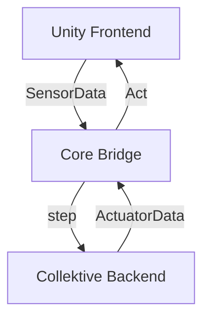

# Lowering the Reality Gap in Aggregate Programs Validation: Running Collektive Over Unity

Master’s Degree in Computer Science and Engineering

Filippo Gurioli

  <a href="https://github.com/FilippoGurioli-master-thesis" target="_blank" class="slidev-icon-btn">
    <carbon:logo-github />
  </a>

<!--
- Mi presento
- Leggo il titolo
- Spiego i concetti principali: reality gap, aggregate program e validation
-->

---
transition: slide-up
layout: image-right
image: https://media0.giphy.com/media/v1.Y2lkPTc5MGI3NjExbmFyMWFnbnJpMDNwaGkzOHN1aTJubTJvcG5kOTVzZXVqMjZ2MmI5MCZlcD12MV9pbnRlcm5hbF9naWZfYnlfaWQmY3Q9Zw/ITRemFlr5tS39AzQUL/giphy.gif
---

# Context

Modern computing is shifting from isolated machines to **massively interconnected collectives** — IoT networks, smart cities, drone swarms.

These are **Complex Adaptive Systems (CAS)**: thousands of agents coordinating through local interactions, with no central controller.

> Testing them requires simulation — but not all simulators are equal.

<!--
Partendo dal concetto di aggregate programs:
- definizione di CAS
- aggregate programming è soluzione per rappresentare CAS
- Collektive è un framework in Kotlin per aggregate program
-->

---
transition: slide-left
---

# Simulation Landscape

  
High-Fidelity Simulators

  
  
  
Realistic physics, 3D environments but no collective programming support

  

  

  
CAS Simulators

  
  
  
Aggregate computing support but simplified, grid-based environments

<!--
Attaccandomi al concetto di validation:
- per validare aggregate program una possibile soluzione sono le simulazioni
- le simulazioni sono vantaggiose perchè:
  - più economiche
  - più veloci
- esistono 2 macro categorie di simulatori attualmente:
  - simulatori ad alta fedeltà (di cui Unity è un esempio)
  - simulatori specifici per i CAS (ad esempio Alchemist)
-->

---
transition: slide-left
---

# Problem Statement

No good integration between high-fidelity simulators for Complex Adaptive Systems

  
  

    The further right, the more realistic — but the harder to program collective behaviors.
  

<!--
- Non esiste un simulatore che sia ad alta fedeltà specifico per i CAS
- Il mio obiettivo è quindi di creare proprio una conguinzione tra questi due mondi
-->

---
layout: two-cols
transition: slide-up
---

# Solution

- **Unity Frontend** — 3D physics environment
- **Core Bridge** — ???Foreign Function Interface (FFI) + Protocol Buffers
- **Collektive Backend** — aggregate logic

But why FFI?

::right::

<!--
- Il framework che utilizzerò BE è Collektive: scritto in Kotlin
- Il framework che utilizzerò FE è Unity: scritto in C#
- come unire due linguaggi che non condividono nulla?
- uniche soluzioni: comunicazione inter processo o comunicazione intra processo
[click1] - soluzione che ho adottato: Foreign Function Interface
[click1] - perchè?
-->

---
transition: slide-up
---

# The Challenge

A CAS simulation is only meaningful with **enough nodes** — the bridge must be fast enough to support them in real-time.

  Every simulation tick, <strong>each node</strong> crosses the bridge:

  

    
20 Hz

    
execution frequency

  

  

    
100+

    
nodes simultaneously

  

  

    
≥ 30 FPS

    
real-time constraint

  

→ The communication technology is critical.

<!--
- I simulatori per i CAS devono essere il più efficienti possibile
  - Tanti nodi che eseguono computazioni asincrone sono molto resource intensive
- Come obiettivo mi sono posto:
  - almeno 20Hz di frequenza d'esecuzione
  - almeno 100 nodi nella simulazione
  - almeno 30 FPS durante la simulazione
-->

---

# FFI vs Sockets

  
What was compared

  <ul class="text-sm text-gray-800 flex flex-col gap-2">
    <li><strong>Socket-based</strong> — Unity and Collektive as separate processes, communicating via TCP</li>
    <li><strong>FFI-based</strong> — Collektive compiled as a native shared library, invoked directly by Unity</li>
  </ul>

  
Setup

  <ul class="text-sm text-gray-800 flex flex-col gap-2">
    <li>12 stationary nodes, identical Unity scenes</li>
    <li>1000+ execution cycles, first 30 discarded (warm-up)</li>
    <li>Distance-based gradient propagation as collective program</li>
  </ul>

  
Results

  <table class="text-sm w-full">
    <thead>
      <tr class="text-[#146b8c]">
        <th class="text-left">Metric</th>
        <th class="text-right">FFI</th>
        <th class="text-right">Socket</th>
        <th class="text-right text-yellow-600">Speedup</th>
      </tr>
    </thead>
    <tbody class="text-gray-800">
      <tr><td>Median e2e</td><td class="text-right">550 µs</td><td class="text-right">200 ms</td><td class="text-right text-yellow-600">363×</td></tr>
      <tr><td>Mean e2e</td><td class="text-right">484 µs</td><td class="text-right">200 ms</td><td class="text-right text-yellow-600">456×</td></tr>
      <tr><td>p95 e2e</td><td class="text-right">612 µs</td><td class="text-right">200 ms</td><td class="text-right text-yellow-600">719×</td></tr>
      <tr><td>p99 e2e</td><td class="text-right">850 µs</td><td class="text-right">202 ms</td><td class="text-right text-yellow-600">747×</td></tr>
    </tbody>
  </table>

  

    FFI is up to 747× faster — the only viable choice.
  

<!--
- quindi, tornando alla domanda di prima, perchè FFI?
- perchè le comunicazioni inter processo come Socket sono molto più lente
[click1] - al 99° percentile è 747 volte più veloce FFI
-->

---
transition: fade-out
---

# Case Study: Environment-aware Gradient Ascent

  

    
A swarm of nodes must <strong>navigate toward a source</strong> while dynamically avoiding obstacles.

    <ul class="text-sm flex flex-col gap-2">
      <li><strong>Collective intelligence</strong> — nodes share source intensity with neighbors to compute the steepest gradient</li>
      <li><strong>Local obstacle avoidance</strong> — each node independently adjusts trajectory to avoid collisions</li>
      <li><strong>Neighborhood</strong> — distance-based, within 10 units</li>
      <li><strong>Frequency</strong> — synchronous rounds at 20Hz</li>
    </ul>
    
Validated in both a <strong>minimal</strong> and a <strong>rich</strong> environment.

  

<!--
- è stato fatto un caso di studio sul simulatore prodotto per poter validare le sue capacità
- la simulazione consiste nell'ascesa di gradiente dei nodi dispiegati all'interno dell'ambiente
- i nodi devono arrivare all'obiettivo cercando di evitare gli ostacoli
  - gli ostacoli sono gli altri nodi e gli ostacoli all'interno dell'ambiente (sassi)
-->

---

# Case Study: Environment-aware Gradient Ascent

  

      <!-- src="https://media.istockphoto.com/id/532142106/it/video/ronzio-serie.mp4?s=mp4-640x640-is&k=20&c=TL5jXPB3M9uge9c1AZgDxTvb3i2BX9pPsOM4v1i9pLg=" -->
  <video
      src="/case-study.mp4"
      class="rounded-lg w-full"
      autoplay
      loop
      muted
      playsinline
    />
  

<!--
- questo è il risultato
-->

---
transition: fade-out
---

# Conclusions

  
Proven

  
Game engines are viable high-fidelity platforms for CAS validation. FFI-based communication reduces inter-language latency to negligible levels, and the rich environment surfaces physical edge cases that abstract simulators never expose.

  
Limitation

  
Execution is globally synchronous — every node fires at the same tick. Real CAS deployments are asynchronous, so failure modes under heterogeneous round frequencies remain untested.

  
Future Work

  
Transition to a per-node asynchronous model — the most impactful step toward closing the remaining gap between simulation and physical deployment.

<!--
TODO
-->

---
layout: center
class: text-center
---

# Thank you

