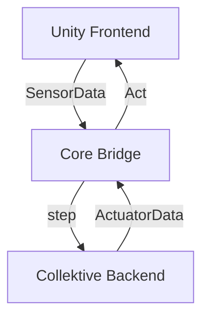

# Lowering the Reality Gap in Aggregate Programs Validation: Running Collektive Over Unity

Master’s Degree in Computer Science and Engineering

Filippo Gurioli

<div class="abs-br m-6 text-xl">
  <a href="https://github.com/FilippoGurioli-master-thesis" target="_blank" class="slidev-icon-btn">
    <carbon:logo-github />
  </a>
</div>

---
transition: fade-out
---

# Context

Complex Adaptive Systems -
Simulators -
Reality Gap

<!--
-->

<style>
h1 {
  background-color: #2B90B6;
  background-image: linear-gradient(45deg, #4EC5D4 10%, #146b8c 20%);
  background-size: 100%;
  -webkit-background-clip: text;
  -moz-background-clip: text;
  -webkit-text-fill-color: transparent;
  -moz-text-fill-color: transparent;
}
</style>

---
transition: slide-left
---

# Problem statement

no good integration between high-fidelity simulators and aggregate computing

---
layout: two-cols
transition: slide-up
---

# Solution

- **Unity Frontend** — 3D physics environment
- **Core Bridge** — FFI + Protocol Buffers
- **Collektive Backend** — aggregate logic


::right::

<div class="flex h-full items-center justify-center">



</div>

---

# The Challenge

The fastest integration

```kt [entrypoint.kt] twoslash
fun Aggregate<Int>.entrypoint(sensorData: SensorData): ActuatorData
```

---

# Comparing FFI with Sockets


---

# Case Study

Description + video!

---

# Results

Talk about data.

The <span v-mark.red="1"><code>v-mark</code> directive</span>
also allows you to add
<span v-mark.circle.orange="2">inline marks</span>
, powered by [Rough Notation](https://roughnotation.com/):

---

# Conclusions

- what was proven
- a weakness
- future work

---
layout: center
class: text-center
---

# Thank you

