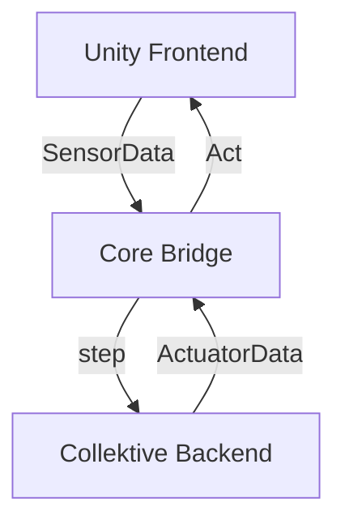

# Lowering the Reality Gap in Aggregate Programs Validation: Running Collektive Over Unity

Master’s Degree in Computer Science and Engineering

Filippo Gurioli

<div class="abs-br m-6 text-xl">
  <a href="https://github.com/FilippoGurioli-master-thesis" target="_blank" class="slidev-icon-btn">
    <carbon:logo-github />
  </a>
</div>

---
transition: slide-up
layout: image-right
image: https://media0.giphy.com/media/v1.Y2lkPTc5MGI3NjExbmFyMWFnbnJpMDNwaGkzOHN1aTJubTJvcG5kOTVzZXVqMjZ2MmI5MCZlcD12MV9pbnRlcm5hbF9naWZfYnlfaWQmY3Q9Zw/ITRemFlr5tS39AzQUL/giphy.gif
---

# Context

Modern computing is shifting from isolated machines to **massively interconnected collectives** — IoT networks, smart cities, drone swarms.

These are **Complex Adaptive Systems (CAS)**: thousands of agents coordinating through local interactions, with no central controller.

> Testing them requires simulation — but not all simulators are equal.

<style>
h1 {
  background-color: #2B90B6;
  background-image: linear-gradient(45deg, #4EC5D4 10%, #146b8c 20%);
  background-size: 100%;
  -webkit-background-clip: text;
  -moz-background-clip: text;
  -webkit-text-fill-color: transparent;
  -moz-text-fill-color: transparent;
}
</style>

---
transition: fade-out
---

# Simulation Landscape

<div class="mt-6 grid grid-cols-[1fr_auto_1fr] gap-8">

<div class="flex flex-col items-center gap-3">
  <p class="text-center font-semibold text-blue-400">High-Fidelity Simulators</p>
  
  
  <p class="text-sm text-center text-gray-400">Realistic physics, 3D environments<br/>but no collective programming support</p>
</div>

<div class="flex items-center justify-center">
  <div class="h-full w-px bg-[#000000] opacity-80 flex flex-col items-center justify-center relative">
  </div>
</div>

<div class="flex flex-col items-center gap-3">
  <p class="text-center font-semibold text-green-400">CAS Simulators</p>
  
  
  <p class="text-sm text-center text-gray-400">Aggregate computing support<br/>but simplified, grid-based environments</p>
</div>

</div>

<!--
-->

---
transition: slide-left
---

# Problem Statement

No good integration between high-fidelity simulators for Complex Adaptive Systems

<div class="flex flex-col items-center gap-4 mt-4">
  
  <p class="text-center text-gray-400 text-sm">
    The further right, the more realistic — but the harder to program collective behaviors.
  </p>
</div>

---
layout: two-cols
transition: slide-up
---

# Solution

- **Unity Frontend** — 3D physics environment
- **Core Bridge** — FFI + Protocol Buffers
- **Collektive Backend** — aggregate logic

::right::

<div class="flex h-full items-center justify-center">



</div>

---
transition: slide-up
---

# The Challenge

The fastest integration

```kt [entrypoint.kt] twoslash
fun Aggregate<Int>.entrypoint(sensorData: SensorData): ActuatorData
```

---

# Comparing FFI with Sockets


---

# Case Study

Description + video!

---

# Results

Talk about data.

The <span v-mark.red="1"><code>v-mark</code> directive</span>
also allows you to add
<span v-mark.circle.orange="2">inline marks</span>
, powered by [Rough Notation](https://roughnotation.com/):

---

# Conclusions

- what was proven
- a weakness
- future work

---
layout: center
class: text-center
---

# Thank you

